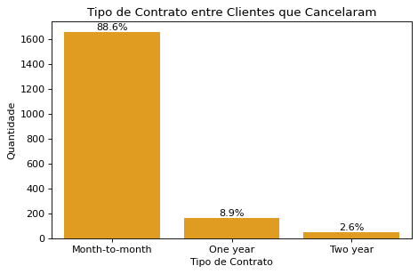
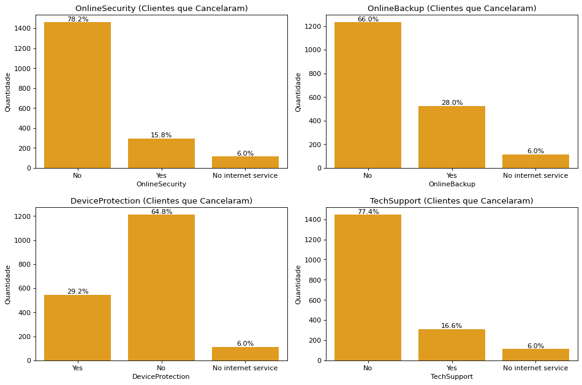
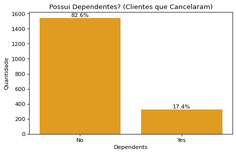
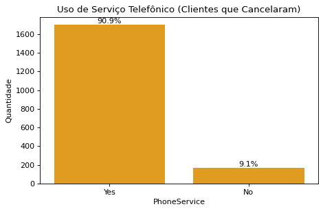
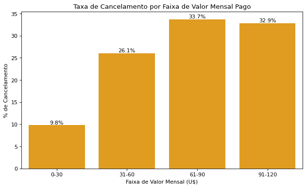

# 📉 Análise de Cancelamento de Clientes – TelecomX

Este projeto tem como objetivo analisar os dados de clientes que cancelaram seus serviços em uma empresa fictícia de telecomunicações, a **TelecomX**. A análise busca identificar padrões, gerar hipóteses e propor estratégias para reduzir o churn (cancelamento de clientes).

## 📊 Sobre o Projeto

- 🔍 **Objetivo:** Entender os principais fatores relacionados aos cancelamentos.
- 📁 **Base de Dados:** 7.267 clientes.
- ❌ **Cancelamentos identificados:** 1.870 clientes (~25,7%).

> Análise realizada com Python, utilizando bibliotecas como Pandas, Matplotlib e Seaborn.

---

## 🧹 Tratamento de Dados

- Remoção e tratamento de valores nulos.
- Conversão de colunas categóricas (ex: `Churn`) para análise numérica.
- Normalização dos campos `Charges.Monthly` e `Charges.Total`.
- Criação de gráficos e segmentações baseadas apenas nos clientes que cancelaram.

---

## 🔎 Principais Descobertas

### 1️⃣ Tipo de Contrato

- **88,6%** dos cancelamentos estão associados a contratos **mensais**.

📊 Gráfico:

💡 _Hipótese: contratos mensais possuem menor fidelização. Clientes podem cancelar facilmente._

---

### 2️⃣ Serviços Adicionais

A maioria dos clientes que cancelaram **não contratavam serviços complementares**:

- Online Security: **66%**
- Backup Online: **64%**
- Device Protection: **65%**
- Suporte Técnico: **78%**

📊 Gráfico:

💡 _Hipótese: menor envolvimento com a empresa gera menor percepção de valor e maior propensão ao cancelamento._

---

### 3️⃣ Perfil do Cliente

- **83%** dos que cancelaram **não tinham dependentes**.
- **91%** **não utilizavam serviço telefônico**.

📊 Gráficos:

  

💡 _Hipótese: clientes com poucos vínculos e menos serviços contratados cancelam com mais facilidade._

---

### 4️⃣ Valor Mensal Pago

- A maioria dos cancelamentos está concentrada entre **60 a 90 dólares/mês**.
- Tendência de maior churn entre clientes que pagam mais.

📊 Gráfico:

💡 _Hipótese: clientes que pagam mais esperam maior valor percebido. A falta de benefícios claros pode gerar insatisfação._

---

## ✅ Conclusões e Recomendações

📌 **Pontos Críticos de Churn:**
- Contratos mensais
- Poucos serviços contratados
- Menor engajamento (sem dependentes ou telefone)
- Mensalidades altas sem retorno percebido

🚀 **Ações recomendadas:**
- Incentivar migração para planos anuais (oferecendo descontos ou bônus).
- Aumentar engajamento com pacotes de serviços gratuitos por tempo limitado.
- Campanhas de retenção para clientes com alto valor mensal.

---

